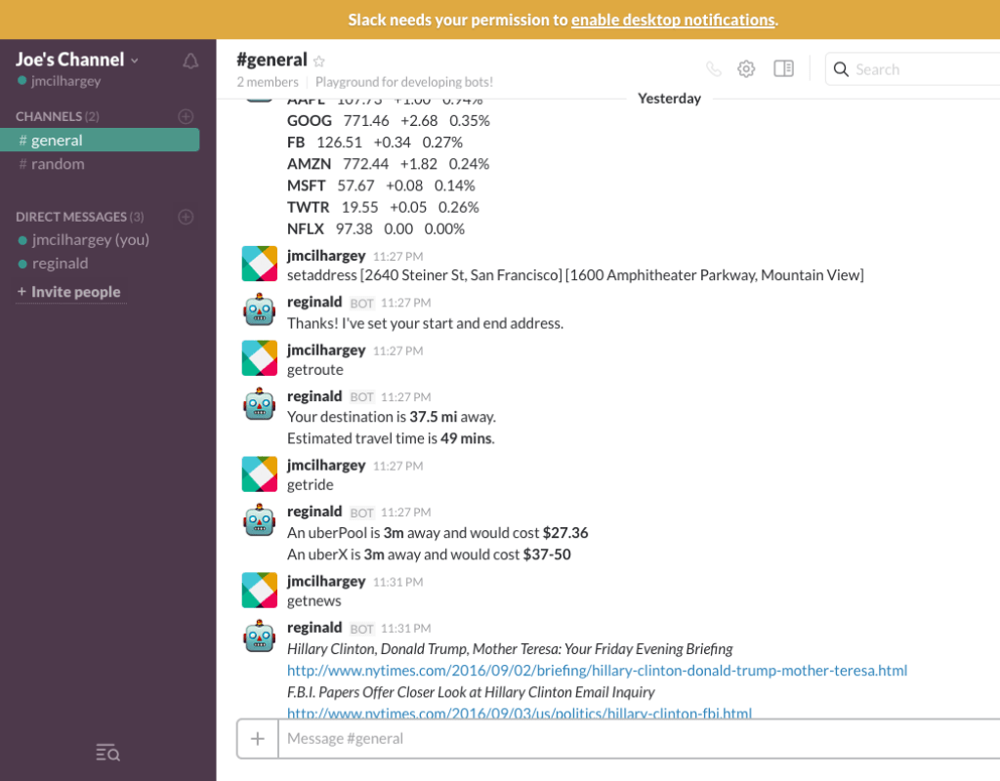

# A Talented Slack Bot

## Overview

A slack bot built in Node that connects the Slack Real Time Messaging API and opens a websocket connection to send and receive data from the Slack client. The bot listens for keywords in the chat to pull data from Google, New York Times, Uber, Quandl Financial, and OpenWeather APIs

## Install

The following must be installed to run the project:

* Node    
* NPM

And to install the application dependencies:

    $ npm install

## Run

To create a shiny new bot, sign in to Slack to go to https://my.slack.com/services/new/bot

Copy the bot API token as an environment variable. See the env.sample.js for a list of the environment variable names.

This new bot requires access to a variety of (free) services in order to respond to requests. Note that some APIs are dependent on one another. For instance the Google Geolocation API is used to fetch coordinates that then estimate Uber fares via the Uber API.

Google Geolocation API https://developers.google.com/maps/documentation/geolocation/intro
Google Directions API https://developers.google.com/maps/documentation/directions/
New York Times API https://developer.nytimes.com/
Uber API https://developer.uber.com/docs/riders/guides/authentication/introduction#api-token-authentication
Quandl API https://www.quandl.com/docs/api
OpenWeather https://openweathermap.org/appid

__Note__ for Google there's a single API key. However, both APIs must be enabled from the Google Developer Console.

To start the app:

    $ npm run start

With a successful connection, a message will print:

    Connected to Slack!

## Slack Commands

To execute commands, send messages in the general channel or message the bot directly

    setstocks[TICKER1, TICKER2, TICKER3]

Bot saves a list of stocks by ticker symbol, where each stock is separated by a comma and the list is enclosed in brackets

    getstocks

For saved stocks, bot fetches the current price, daily change in dollars / cents and daily change in percentage

    setaddress [Start Address] [End Address]

Bot saves starting address and ending address both separated by a pair of brackets

    getroute

For saved addresses, bot fetches current traffic conditions, calculates the fastest route and estimates the time it will take to reach the destination

    getride

For saved addresses, bot requests travel info from Uber to give the time it will take for an UberPool and UberX to arrive at the start address and gives Uber's estimated cost to reach the end address

    getnews

Bot retrieves the top 10 news stories featured on New York Times website according to views, shares, and recency

    getweather

For saved start address, bot gives the 5 day forecast

## Test

To run the test suite, type the command:

    $ npm run test

## Stack

| Back-End
|:---------   
| Node.js
| Express
| Websockets
| REST APIs

## License

MIT License
